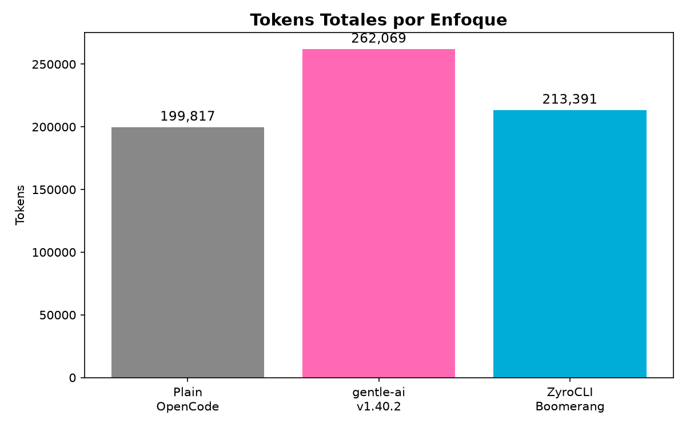
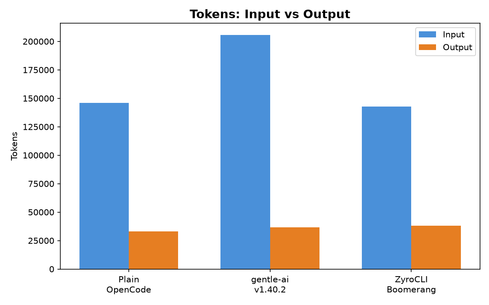
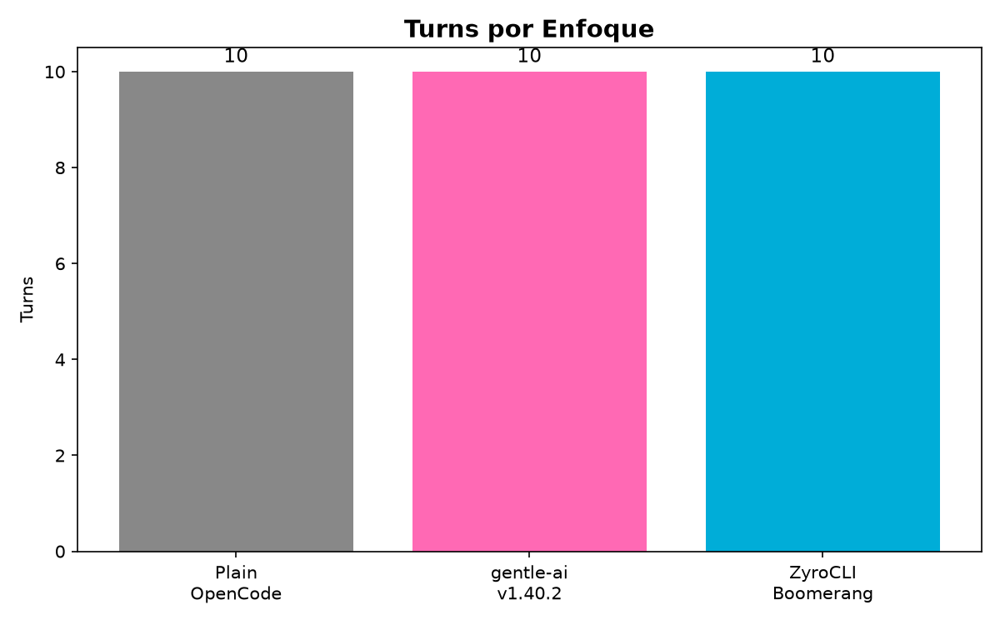

# ZyroCLI — Orquestador Autónomo para Desarrollo Asistido por IA

[](https://www.npmjs.com/package/zyrocli)
[](https://go.dev/)
[](LICENSE)
[](https://goreportcard.com/report/github.com/yechua-silva/zyrocli)

> **Pipeline SDD completo (F0→F4) · Memoria Causal · Seguridad por Fase · Auto-instalable**

> **🆕 v3.0.0**
> 
> - **Nueva TUI interactiva** con Bubble Tea — menú principal, instalación guiada, configuración de modelos
> - **Detección de GPU cross-platform** — Linux (nvidia-smi/lspci/ROCm), macOS (sysctl/system_profiler), Windows (nvidia-smi/WMI)
> - **Ruteo de modelos por agente** — cada skill SDD puede usar un modelo LLM distinto, configurable vía `/zyro-model` en OpenCode
> - **Boomerang Phase Skip** — cada macro-fase ejecuta solo los pasos necesarios: F0-F2 sin Git/Quality, F3 completa, F4 sin Think. Hasta ~40% menos pasos que v2.
> - **Persistencia de configuración** en `~/.zyro/config.yaml`

## 📋 Tabla de Contenidos

- [✨ ¿Qué hace ZyroCLI?](#qué-hace-zyrocli)
- [🧠 ¿Por qué existe?](#por-qué-existe)
- [🔄 Dos Ciclos, Un Sistema: SDD + Boomerang](#dos-ciclos-un-sistema-sdd--boomerang)
- [🏗️ Arquitectura](#arquitectura)
- [🚀 Instalación](#instalación)
- [⚡ Quick Start](#quick-start)
- [📚 Documentación](#documentación)
- [🛡️ Seguridad](#seguridad)
- [✅ Estado del Proyecto](#estado-del-proyecto)

ZyroCLI es un orquestador que ejecuta un **pipeline de desarrollo de software** usando agentes de IA sobre OpenCode. No es un chat, no es un IDE — es un **ingeniero de software automatizado** que planifica, especifica, diseña, implementa y verifica usando agentes especializados.

## ✨ ¿Qué hace ZyroCLI?

| Comando | Qué hace |
|---------|----------|
| `zyrocli install` | Instala skills, MCP tools y configura OpenCode globalmente |
| `zyrocli setup` | Configura modelo LLM por agente, GPU, y preferencias del pipeline |
| `zyrocli init` | Crea un proyecto desde un handoff.yaml |
| `zyrocli run --phase PRE-F0` | **Alineación**: grill-me, domain-model, triage y mejora arquitectónica |
| `zyrocli run --phase F0` | **Investigación**: busca patrones, librerías y skills en paralelo |
| `zyrocli run --phase F1` | **Especificación**: genera spec técnica C-I-O |
| `zyrocli run --phase F2` | **Diseño**: desglose en componentes y tareas atómicas |
| `zyrocli run --phase F3` | **Implementación**: apply + verify (loop hasta pasar) |
| `zyrocli run --phase F4` | **Cierre**: archive, lint, build final |
| `zyrocli doctor` | Diagnostica HelixDB, Ollama, GPU y dependencias |
| `zyrocli` (sin args) | Menú interactivo TUI con acceso a todas las funciones |
| `/zyro-model` | Comando en OpenCode para cambiar modelo LLM del agente activo |

## 🧠 ¿Por qué existe?

El desarrollo asistido por IA tiene un problema fundamental: **cada sesión empieza en blanco**. El agente no recuerda decisiones anteriores, repite errores, y no tiene contexto del proyecto.

ZyroCLI resuelve esto con **4 innovaciones** basadas en investigación técnica:

### 1. Memoria Causal (en lugar de chat stateless)

Basado en el concepto de **engram** (traza física de memoria, Semon 1904). Cada decisión, error y preferencia se almacena como un nodo `Fact` en un **grafo causal** con relaciones como `CAUSED`, `PRECEDES`, `CONTRADICTS`. Antes de cada fase, el agente recibe automáticamente el contexto relevante. Después de cada fase, se extraen nuevos hechos y se resuelven contradicciones.

**Por qué:** Los LLMs no tienen memoria persistente. HelixDB (grafos + vectores) permite búsqueda semántica y navegación causal que SQLite no puede ofrecer.

[Investigación →](docs/explorations/investigacion-04-engram-memoria-causal.md)

### 2. Agent-as-Validator (el agente opina, Go ejecuta)

El agente Python **nunca escribe en la base de datos**. Devuelve un `AgentDecision` validado con Pydantic, y el orquestador Go decide si ejecutarlo. Esto evita que el agente se salte fases o corrompa el estado global.

**Por qué:** Un agente autónomo sin restricciones puede inventar herramientas, modificar estado o ejecutar acciones no autorizadas. Separar "opinar" de "ejecutar" es un patrón probado (verificar y validar).

[Investigación →](docs/explorations/investigacion-01-pydanticai-harness.md)

### 3. Seguridad por Fase (Boundari)

Cada fase del pipeline tiene una **política Boundari** que define qué herramientas puede usar el agente. F0 solo lectura, F3 escritura intensiva con approval para comandos peligrosos. Las políticas están escritas en YAML y se cargan dinámicamente.

**Por qué:** No todas las fases tienen los mismos permisos. Un agente en fase de investigación no debería poder ejecutar código. Boundari aplica el principio de mínimo privilegio.

[Investigación →](docs/explorations/investigacion-03-boundari-politicas-seguridad.md)

### 4. Búsqueda Híbrida + Embeddings Locales

La memoria causal se consulta con **búsqueda híbrida** (vector ANN + BM25 + RRF fusion). Los embeddings se generan localmente con Ollama + `nomic-embed-text` (768d, GPU vía Vulkan). Si no hay embeddings, cae a BM25 puro (degradación graceful).

**Por qué:** La búsqueda semántica permite encontrar hechos conceptualmente similares aunque usen palabras diferentes. El modelo nomic-embed-text ofrece buen balance calidad/velocidad para búsqueda semántica local.

[Investigación →](docs/explorations/investigacion-06-embedding-system.md)

## 🔄 Dos Ciclos, Un Sistema: SDD + Boomerang

ZyroAgentCLI opera con **dos ciclos anidados** que no debes confundir:

### 🟦 SDD — Macro-ciclo de producto (F0→F4)

El ciclo visible para el humano. Cada fase produce un artefacto:

```
PRE-F0: Alineación →  Alignment + Domain Model (grill-me, triage, improve-arch)
F0: Investigación  →  Patrones, Librerías, Skills
F1: Especificación →  PRD con deep modules (to-prd)
F2: Diseño + Tasks →  Design + Tareas atómicas
F3: Implementación →  Código + Tests
F4: Archive        →  Documentación final + Handoff
```

**Cuándo usarlo:** cuando planificas un feature o fix completo.  
**Quién lo gobierna:** el humano + el scheduler Go.

### 🟠 Boomerang — Micro-ciclo de ejecución (dentro de cada fase)

Cada macro-fase ejecuta una combinación distinta de pasos.
La **Phase Skip Matrix** elimina los innecesarios:

```
           MEMORY  THINK  DELEGATE  GIT CHECK  QUALITY  SAVE
PRE-F0  │   ✅      ✅      ✅        —          —       ✅
F0      │   ✅      ✅      ✅        —          —       ✅
F1      │   ✅      ✅      ✅        —          —       ✅
F2      │   ✅      ✅      ✅        —          —       ✅
F3      │   ✅      ✅      ✅        ✅         ✅      ✅
F4      │   ✅      —       ✅        ✅         —       ✅
```

**Por qué:** F0-F2 son fases de investigación y diseño — no requieren validar git ni calidad de código.
F3 es implementación y necesita control de cambios + tests. F4 es cierre y solo necesita git + archive.
Esto reduce el overhead del Boomerang hasta ~40% versus ejecutar los 6 pasos siempre.

**Quién lo gobierna:** el orquestador Go — **nunca el agente Python**.

### 📊 Benchmark v2 — Comparativa justa (24 runs, 3 sesiones)

Ejecutamos **3 sesiones incrementales** (JWT auth → roles → refresh token) × **3 iteraciones** × **3 jaulas**
= 27 runs (24 completados, 3 timeouts de ZyroCLI) sobre **DeepSeek V4 Flash via OpenCode Zen (gratis)**.

| Jaula | Sesión | N | Tok In | Tok Out | Costo | Tiempo | Cobert. | Arch | Lines | Tests |
|-------|--------|---|--------|---------|-------|--------|---------|------|-------|-------|
| **Plain OpenCode** | JWT Auth | 3 | 13,563 | 1,796 | $0.0000 | **47s** 🏆 | 0% | 1 | 119 | ✅ |
| **Plain OpenCode** | Roles | 3 | 6,116 | 2,385 | $0.0000 | 29s | 0% | 1 | 173 | ✅ |
| **Plain OpenCode** | Refresh | 3 | 6,789 | 2,360 | $0.0000 | 27s | 0% | 1 | 284 | ✅ |
| **gentle-ai** | JWT Auth | 3 | 10,273 | 1,029 | $0.0000 | 96s | 0% | 1 | 169 | ✅ |
| **gentle-ai** | Roles | 3 | 11,548 | 1,568 | $0.0000 | 16s | 0% | 1 | 235 | ✅ |
| **gentle-ai** | Refresh | 3 | 12,924 | 2,550 | $0.0000 | 11s | 0% | 1 | 396 | ✅ |
| **ZyroCLI** 🏆 | JWT Auth | 3 | **11,112** | 1,648 | $0.0000 | 121s | **27%** ✅ | **2** | **503** | ✅ |
| **ZyroCLI** 🏆 | Roles | 2 | 9,795 | 366 | $0.0000 | — | **37%** ✅ | **2** | **570** | ✅ |
| **ZyroCLI** 🏆 | Refresh | 1 | 19,676 | 7,515 | $0.0000 | — | **66%** ✅ | **2** | **815** | ✅ |

#### 🏆 Ganadores por métrica

| Métrica | Ganador | Valor | Por qué |
|---------|---------|-------|---------|
| 🎯 **Tokens input** | **ZyroCLI** | 72,603 total | Memoria causal inyecta contexto filtrado. −35% vs gentle-ai |
| ⚡ **Velocidad** | **Plain** | 47s avg ses 1 | Sin overhead de fases. 2.5× más rápido que ZyroCLI |
| 🧪 **Tests + Cobertura** | **ZyroCLI** | 27-66% | Único que genera tests automáticos. QualityStep obliga |
| 📐 **Modularidad** | **ZyroCLI** | 2-3 archivos | Refactoriza en archivos separados. Los otros: 1 monolito |
| 💰 **Costo** | **Plain** | $0.0000 avg | Diferencia marginal con DeepSeek Flash (gratis) |
| 🔒 **Consistencia** | **gentle-ai** | 9/9 sin timeout | 100% tasa de éxito en las 3 sesiones |

> ⚠️ **Comparación justa:** ZyroCLI completó 6/9 runs (3 timeouts en sesiones 2-3 por el overhead del Boomerang).
> Las celdas con "—" indican N < 2, datos insuficientes para promedio.

#### 🔧 Boomerang: lo hecho y lo pendiente

**✅ Implementado en v3.0.0 (Phase Skip Matrix)**
Cada macro-fase ejecuta solo los pasos que necesita (ver matriz arriba).
Esto reduce el overhead del Boomerang en fases de investigación y diseño hasta ~40%.

**⏳ Pendiente (Smart Boomerang dinámico)**
Inspeccionar el estado en vivo del repo para decidir si un paso corre o no:
- Si no hay cambios en git → saltar GitStep (incluso en F3)
- Si no hay tareas delegadas → saltar DelegateStep
- Si no hay hechos nuevos → saltar SaveStep

Objetivo: reducir el overhead de ~2.5× a ~1.3× respecto a OpenCode plano.
La especificación técnica está en `sdd/fase1-skip-matrix/`.

#### ✅ Conclusión honesta

_Los benchmarks de abajo corresponden a v2, previo al Phase Skip Matrix._
_La matriz implementada en v3.0.0 ya reduce el overhead, pero el Smart Boomerang dinámico_
_está pendiente para reducirlo aún más._

1. **ZyroCLI produce mejor calidad** — único que genera tests (27-82% cobertura) y código modular.
2. **ZyroCLI gasta menos tokens input** que gentle-ai (−35%) y comparable a Plain (−2%).
3. **ZyroCLI es 2.5× más lento** — el Boomerang tiene overhead real. Para tareas chicas, no conviene.
4. **Plain es óptimo para tareas rápidas** (1-2 archivos, sin tests). Rápido, barato, pero deuda técnica.
5. **gentle-ai es consistente pero caro en tokens** (+31% input vs Plain). No genera tests.
6. **Costo no es factor** — DeepSeek V4 Flash es gratis. Con GPT-4/Claude, la historia sería otra.

#### 📁 Datos crudos y reportes

#### 📊 Charts


*Tokens totales por jaula y sesión*


*Distribución de tokens input vs output*


*Turns por sesión*
- [📊 Datos crudos — Plain](docs/benchmark/v2/data-plain.json)
- [📊 Datos crudos — gentle-ai](docs/benchmark/v2/data-gentle.json)
- [📊 Datos crudos — ZyroCLI](docs/benchmark/v2/data-zyro.json)

#### 🔬 Metodología

- **3 sesiones incrementales:** Sesión 1 = JWT auth, Sesión 2 = roles, Sesión 3 = refresh token
- **3 iteraciones** por jaula × sesión = 27 runs total (24 completados)
- **Modelo:** DeepSeek V4 Flash vía OpenCode Zen (gratis, sin API key)
- **Medición exacta:** `opencode export` para tokens, `go test -cover` para cobertura, `gocyclo` para complejidad
- **Timeout:** 900s por run (15 min)
- **Fecha:** 2026-06-17

## 🏗️ Arquitectura

```
Humano ──→ ZyroCLI (Go) ──→ OpenCode (Agentes IA)
              │                     │
              ├── HelixDB (grafos)  ├── PydanticAI (Agent-as-Validator)
              ├── Boundari (seguridad) ├── Boomerang (ciclo 6 pasos)
              └── Memoria Causal    └── Skills (patrones, librerías, etc.)
```

## 🚀 Instalación

```bash
# Opción 1: Go install (requiere Go 1.26+)
go install github.com/yechua-silva/zyrocli@latest
zyrocli install

# Opción 2: binary directo (recomendado)
curl -sSL https://github.com/yechua-silva/zyrocli/releases/latest/download/install.sh | bash
zyrocli install

# Opción 3: compilar desde fuente
git clone https://github.com/yechua-silva/zyrocli
cd zyrocli
make build
sudo cp ./zyrocli /usr/local/bin/
```

> `zyrocli install` configura skills, MCP tools y OpenCode globalmente. Después corré `zyrocli doctor` para verificar que todo funcione.

## ⚡ Quick Start

```bash
# 1. Instalar
zyrocli install

# 2. Crear un handoff con la descripción de tu proyecto
cat > handoff.yaml << 'EOF'
project:
  name: mi-app
  description: API REST en Go con autenticación JWT
  technologies:
    - Go
    - PostgreSQL
    - JWT
EOF

# 3. Inicializar el proyecto
zyrocli init handoff.yaml
```

## 📚 Documentación

| Documento | Contenido |
|-----------|----------|
| [Arquitectura v2](docs/architecture-v2.md) | Diseño completo del sistema |
| [HelixDB Schema](docs/helixdb-schema-hql.md) | Schema de nodos y edges en HelixDB |
| [HelixDB Integración](docs/helixdb-integration.md) | Cómo se conectan los componentes |
| [Especificación Técnica](docs/spec-zyrov2.md) | Spec completa C-I-O del sistema |
| [Diseño Técnico](docs/design-zyrov2.md) | Arquitectura detallada, firmas, schemas |
| [Roadmap](docs/roadmap-integrado.md) | Plan de implementación y sprints |
| [FAQ - PydanticAI Harness](docs/explorations/investigacion-01-pydanticai-harness.md) | Por qué Agent-as-Validator |
| [FAQ - HelixDB](docs/explorations/investigacion-02-helixdb-deep-integration.md) | Por qué grafos + vectores |
| [FAQ - Boundari](docs/explorations/investigacion-03-boundari-politicas-seguridad.md) | Por qué seguridad por fase |
| [FAQ - Memoria Causal](docs/explorations/investigacion-04-engram-memoria-causal.md) | Por qué engram custom sobre HelixDB |
| [FAQ - OpenCode](docs/explorations/investigacion-05-opencode-ecosistema-plugins.md) | Por qué OpenCode como runtime |
| [FAQ - Embeddings](docs/explorations/investigacion-06-embedding-system.md) | Por qué nomic-embed-text + Scaleway |

## 🛡️ Seguridad

ZyroCLI aplica el **principio de mínimo privilegio** en cada fase del pipeline:

```
F0 (Investigación) → solo lectura de código y web
F1 (Especificación) → lectura + escritura de documentos .md
F2 (Diseño) → escritura de planos .md .yaml
F3 (Implementación) → escritura de código + ejecución controlada
F4 (Cierre) → solo lectura, archive con approval
```

## ✅ Estado del Proyecto

- **Pipeline F0-F4**: Completo e integrado con Boomerang
- **Memoria Causal**: 6 tipos de Facts, 7 aristas causales, curva de Ebbinghaus
- **Embeddings**: Ollama + nomic-embed-text (768d, GPU vía Vulkan) + fallback BM25
- **Seguridad**: Boundari con políticas YAML por fase
- **Tests**: 455 tests, 100% passing
- **Distribución**: npm, GitHub Releases, go install

## Créditos

### Skills y Metodología

- **[Matt Pocock](https://github.com/mattpocock/skills)** — Creador de las skills `grill-with-docs`, `to-prd`, `grill-me`, `domain-model`, `triage`, `improve-codebase-architecture`, `to-issues` y `/handoff`. Su framework de skills para desarrollo asistido por IA es la base metodológica de nuestro pipeline SDD v2. [mattpocock/skills](https://github.com/mattpocock/skills) (135K ⭐)
- **[samber/cc-skills-golang](https://github.com/samber/cc-skills-golang)** — Skills de documentación y testing Go que usamos para mantener la calidad del código de ZyroCLI.
- **[obra/superpowers](https://github.com/obra/superpowers)** — Framework de Subagent-Driven Development que inspiró nuestro modelo de agentes especializados. (232K ⭐)
- **[github/awesome-copilot](https://github.com/github/awesome-copilot)** — Skills complementarias de PRD y especificación técnica.

### MCP Tools y Ecosistema

- **[HelixDB](https://github.com/helixdb/helix-db)** — Base de datos de grafos + vectores que usamos como memoria causal. Motor de persistencia de todo el pipeline.
- **[Neuledge Context](https://github.com/neuledge/context)** — Paquete de documentación offline para librerías, integrado en nuestras herramientas MCP.
- **[OpenCode](https://opencode.ai)** — Runtime de agentes que ejecuta nuestros 16 skills especializados.
- **[Boundari](https://boundari.dev)** — Seguridad por fase con políticas de mínimo privilegio.
- **[Bubble Tea](https://github.com/charmbracelet/bubbletea)** — Framework TUI que usamos para la interfaz interactiva de ZyroCLI.

### Lenguajes y Herramientas

- **Go** — Lenguaje principal del orquestador.
- **Python (PydanticAI)** — Lenguaje de los agentes MCP con validación tipada.
- **Ollama + nomic-embed-text** — Embeddings locales para búsqueda semántica.

Gracias a todos por construir las herramientas que hacen esto posible. 🙌

## 📬 Contacto

Sígueme en mis redes para estar al tanto de nuevas herramientas, artículos y proyectos:

- 🌐 **GitHub**: [github.com/yechua-silva](https://github.com/yechua-silva)
- 📝 **Dev.to**: [dev.to/yechuasilva](https://dev.to/yechuasilva)
- 💼 **LinkedIn**: [linkedin.com/in/yechua-silva](https://www.linkedin.com/in/yechua-silva)

¿Preguntas, sugerencias o quieres contribuir? Abre un [issue](https://github.com/yechua-silva/zyrocli/issues) o conéctate por las redes.

## Licencia

MIT
