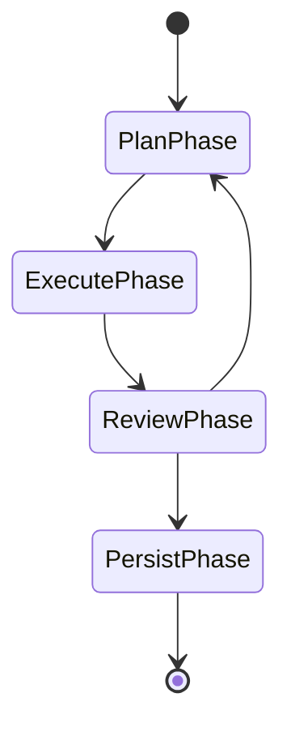

# Investigación: PydanticAI y pydantic-deep como Harness para Agentes Python

**Fecha:** 2026-06-15  
**Proyecto:** ZyroAgentCLI  
**Autor:** Investigación técnica automatizada  
**Propósito:** Evaluar PydanticAI, Pydantic AI Harness y pydantic-deep como plataforma de agentes para reemplazar/fortalecer el MCP server Python actual.

---

## Resumen Ejecutivo

El MCP server Python de ZyroAgentCLI (`mcp-tools/runner.py`) usa `pydantic-ai` y `FastMCP` pero **no usa el sistema de agentes de PydanticAI** sino que expone tools individuales como funciones sueltas registradas en `FastMCP`. Esto significa que:

1. **No hay un agente PydanticAI** — solo tools HTTP/RPC sin orquestación.
2. **No hay control de flujo** — cada tool se ejecuta de forma aislada, sin capacidad de secuenciar fases.
3. **No hay approval gates** — `helix_write.py` escribe directamente a HelixDB sin supervisión.
4. **No hay validación de salida** — todo retorna `json.dumps()` manual, sin `output_type` tipado.
5. **No hay memoria ni contexto entre llamadas.**

PydanticAI **sí es el framework correcto** para ZyroAgentCLI. La versión actual (`pydantic-ai >= 1.95`) incluye todo lo necesario: deferred tools con `@tool(requires_approval=True)`, capacidades componibles via `capabilities=[...]`, `PydanticGraph` para state machines, y el nuevo `Pydantic AI Harness` con `CodeMode`, filesystem, shell, sub-agentes y más.

La solución no es cambiar de framework sino **usar correctamente** PydanticAI: crear un agente PydanticAI orquestador que gestione el flujo de fases (plan → execute → review → persist), use `deferred_tools` para approval gates, y delegue escritura a HelixDB **solo desde el orquestador**, no desde los tools.

---

## Problema Identificado: Por qué no funciona el harness actual

### 1. Arquitectura incorrecta: tools sueltos, no agente

```
Estado actual (incorrecto):
runner.py (FastMCP) → helix_write (escribe directo a DB)
                    → search_code (lee DB)
                    → search_skills (lee DB)
                    → task_context (lee DB)
```

Cada tool es una función Python que recibe parámetros y retorna `json.dumps()`. No hay:
- Un agente que coordine fases
- Validación de tipos en outputs
- Historial de conversación
- Capacidad de "el agente decide qué tool llamar"

### 2. Escritura directa a HelixDB sin aprobación

```python
# helix_write.py: escribe DIRECTAMENTE a HelixDB
async def save_to_helix_tool(label: str, properties: dict) -> str:
    client = HelixClient()
    node = await client.create_node(label, properties)  # ¡Sin control!
```

Cualquier cliente MCP puede llamar `save_to_helix` y escribir lo que quiera. No hay:
- Approval gates (human-in-the-loop)
- Validación de política
- Control de qué labels puede escribir cada agente

### 3. PydanticAI infrautilizado

`pyproject.toml` tiene `pydantic-ai` como dependencia pero **no se usa en ningún lado** para crear agents. Solo se usa indirectamente vía `FastMCP`. Se importa pero nunca se instancia `Agent(...)`.

### 4. Sin control de fases

El flujo ideal de ZyroAgentCLI debería ser:
1. **Plan** — agente recibe input, planea qué hacer
2. **Execute** — agente ejecuta herramientas (búsquedas, lectura de archivos)
3. **Review** — agente revisa resultados, pide aprobación si es necesario
4. **Persist** — agente escribe a HelixDB **solo si fue aprobado**

Actualmente no hay fases: todo es una sola llamada atómica.

---

## Documentación Oficial Encontrada

### PydanticAI Core
- **Overview:** https://ai.pydantic.dev/
- **Agents:** https://pydantic.dev/docs/ai/core-concepts/agent/index.md
- **Capabilities:** https://pydantic.dev/docs/ai/core-concepts/capabilities/index.md
- **Deferred Tools (approval gates):** https://pydantic.dev/docs/ai/tools-toolsets/deferred-tools/index.md
- **Function Tools:** https://pydantic.dev/docs/ai/tools-toolsets/tools/index.md
- **Multi-Agent Patterns:** https://pydantic.dev/docs/ai/guides/multi-agent-applications/index.md
- **Hooks:** https://pydantic.dev/docs/ai/core-concepts/hooks/index.md
- **Output (structured):** https://pydantic.dev/docs/ai/core-concepts/output/index.md
- **Dependencies:** https://pydantic.dev/docs/ai/core-concepts/dependencies/index.md
- **Agent Specs (YAML/JSON):** https://pydantic.dev/docs/ai/core-concepts/agent-spec/index.md
- **Messages & Chat History:** https://pydantic.dev/docs/ai/core-concepts/message-history/index.md
- **Testing:** https://pydantic.dev/docs/ai/guides/testing/index.md
- **MCP Client:** https://pydantic.dev/docs/ai/mcp/client/index.md
- **MCP Server:** https://pydantic.dev/docs/ai/mcp/server/index.md
- **llms.txt:** https://ai.pydantic.dev/llms.txt
- **llms-full.txt:** https://ai.pydantic.dev/llms-full.txt

### Pydantic AI Harness (Capability Library)
- **Overview:** https://pydantic.dev/docs/ai/harness/overview/index.md
- **Code Mode:** https://pydantic.dev/docs/ai/harness/code-mode/index.md
- **GitHub Repo:** https://github.com/pydantic/pydantic-ai-harness
- **PyPI:** https://pypi.org/project/pydantic-ai-harness/
- **Capability Matrix:** Incluye: CodeMode, Filesystem, Shell, Sub-agents, Skills, Planning, Memory, Guardrails, Approval Workflows, Cost Tracking, y más.

### Pydantic Graph
- **Overview:** https://pydantic.dev/docs/ai/graph/graph/index.md
- **Graph Builder:** https://pydantic.dev/docs/ai/graph/builder/index.md
- **Steps:** https://pydantic.dev/docs/ai/graph/builder/steps/index.md
- **Joins & Reducers:** https://pydantic.dev/docs/ai/graph/builder/joins/index.md
- **Decisions:** https://pydantic.dev/docs/ai/graph/builder/decisions/index.md

### pydantic-deep (Vstorm)
- **GitHub Repo:** https://github.com/vstorm-co/pydantic-deepagents
- **PyPI:** https://pypi.org/project/pydantic-deep/
- **Docs:** https://vstorm-co.github.io/pydantic-deepagents/
- **Características clave:** Forking en vivo, multi-agente, memoria persistente, checkpoints, sandbox Docker, skills, MCP, cost tracking, plan mode, subagentes.

---

## Patrones de Configuración Recomendados

### Patrón 1: Agente con output estructurado y validación (Agent-as-Validator)

Este es el patrón más importante para ZyroAgentCLI. El agente NO escribe a DB directamente. En lugar de eso, **el agente retorna un JSON validado** y el código del orquestador (el MCP server runner) escribe a DB después de validar.

```
Agente PydanticAI → retorna Pydantic Model validado → orquestador escribe a HelixDB
```

**Ventajas:**
- Validación de tipos y estructura en tiempo de ejecución
- El LLM no puede "saltarse" la escritura
- Se pueden agregar approval gates entre el output y la escritura
- El orquestador puede inspeccionar el output antes de persistir

### Patrón 2: Deferred Tools para Approval Gates (Human-in-the-Loop)

Usar `@tool(requires_approval=True)` o `raise ApprovalRequired` dentro de un tool para detener la ejecución hasta que un humano apruebe. El agente retorna `DeferredToolRequests` que el orquestador resuelve llamando al agente de nuevo con `deferred_tool_results`.

```
Agente.run() → detecta tool que requiere aprobación → retorna DeferredToolRequests
→ Orquestador muestra al humano → Humano aprueba/rechaza
→ Agente.run() con message_history + deferred_tool_results → continúa
```

### Patrón 3: Capabilities para separar concerns

Usar `capabilities=[...]` para agrupar tools relacionados:
- `HelixReadCapability` — tools de solo lectura (search_code, search_skills, task_context)
- `HelixWriteCapability` — tools de escritura (save_to_helix, link_to_project) con `requires_approval=True`
- `AnalysisCapability` — tools de análisis (code review, diff analysis)

### Patrón 4: PydanticGraph para flujo de fases (State Machine)

Para control de flujo complejo (plan → execute → review → persist), usar `pydantic-graph` con estados:



### Patrón 5: Agent-as-Validator Estricto

Inspirado en el principio de "el agente solo opina, el código ejecuta":
1. El agente recibe un input y planea una respuesta
2. El agente retorna un Pydantic Model (`AgentOutput`)
3. El orquestador toma ese output validado y decide ejecutarlo
4. Si el output requiere aprobación, pausa y espera confirmación
5. Solo tras confirmación, el orquestador escribe a HelixDB

---

## Código de Ejemplo: Cómo Debería Configurarse

### Ejemplo 1: Agente PydanticAI con output estructurado + orquestador que escribe

```python
"""agent.py — Agente PydanticAI con patrón Agent-as-Validator"""

from __future__ import annotations

from dataclasses import dataclass
from typing import Annotated

from pydantic import BaseModel, Field
from pydantic_ai import Agent, RunContext


# --- Output types validados ---

class HelixNodeOutput(BaseModel):
    """Output validado del agente. El orquestador lee esto y escribe a DB."""
    label: str = Field(description="Node label (e.g. 'Spec', 'Pattern', 'Task')")
    properties: dict = Field(description="Key-value properties del nodo")
    project_id: int | None = Field(default=None, description="Project ID opcional para linkear")
    requires_approval: bool = Field(
        default=False,
        description="Si True, el orquestador debe pedir aprobación antes de escribir"
    )


class AgentDecision(BaseModel):
    """Decisión completa del agente después de analizar un input."""
    action: str = Field(description="Qué acción tomar: 'create', 'update', 'search', 'skip'")
    reasoning: str = Field(description="Razonamiento paso a paso")
    nodes: list[HelixNodeOutput] = Field(
        default_factory=list,
        description="Nodos a crear/actualizar en HelixDB"
    )


# --- Dependencias ---

@dataclass
class AgentDeps:
    project_id: int | None
    task_id: int | None = None
    user_message: str = ""


# --- Agente ---

orchestrator = Agent[AgentDeps, AgentDecision](
    "openai:gpt-5.2",
    deps_type=AgentDeps,
    output_type=AgentDecision,
    instructions=(
        "Eres un agente orquestador para ZyroAgentCLI. "
        "Tu trabajo es analizar el input del usuario y producir una decisión estructurada. "
        "NO escribes a la base de datos directamente — solo produces JSON validado. "
        "El orquestador (código Python) tomará tu decisión y actuará sobre ella."
    ),
)

# --- Tool de solo lectura (seguro) ---

@orchestrator.tool
async def search_code(ctx: RunContext[AgentDeps], query: str, limit: int = 10) -> str:
    """Search code nodes by text query in HelixDB."""
    # TODO: llamar a HelixClient.text_search
    return f"Results for '{query}': [...]"

@orchestrator.tool
async def task_context(ctx: RunContext[AgentDeps], id: int) -> str:
    """Get full context for a task by ID from HelixDB."""
    # TODO: llamar a HelixClient
    return f"Context for task {id}: [...]"


# --- Uso desde el runner ---

async def run_agent(user_input: str, project_id: int | None = None) -> AgentDecision:
    """Punto de entrada para el orquestador."""
    deps = AgentDeps(project_id=project_id, user_message=user_input)
    result = await orchestrator.run(user_input, deps=deps)
    return result.output
```

### Ejemplo 2: Orquestador que ejecuta la decisión del agente (con approval)

```python
"""runner.py — Orquestador que ejecuta la decisión validada del agente"""

from __future__ import annotations

import json

from agent import AgentDecision, HelixNodeOutput, run_agent
from helix_client import HelixClient


async def process_user_input(user_input: str, project_id: int | None = None) -> str:
    """Procesa input del usuario y ejecuta la decisión del agente."""
    
    # Fase 1: El agente analiza y produce una decisión validada
    decision: AgentDecision = await run_agent(user_input, project_id)
    
    # Fase 2: Validación estructural (Pydantic ya lo hizo, pero reforzamos)
    if decision.action == "skip":
        return json.dumps({"status": "skipped", "reasoning": decision.reasoning})
    
    if decision.action not in ("create", "update", "search"):
        return json.dumps({"error": f"Unknown action: {decision.action}"})
    
    # Fase 3: Procesar cada nodo
    client = HelixClient()
    results = []
    
    for node in decision.nodes:
        if node.requires_approval:
            # Approval gate: no ejecutamos, devolvemos para que el humano decida
            return json.dumps({
                "status": "requires_approval",
                "reasoning": decision.reasoning,
                "pending_nodes": [node.model_dump() for node in decision.nodes],
            })
        
        # Solo el orquestador escribe a DB, NUNCA el agente directamente
        created = await client.create_node(node.label, node.properties)
        results.append({"label": node.label, "id": created.get("id")})
    
    return json.dumps({
        "status": "ok",
        "reasoning": decision.reasoning,
        "nodes_created": results,
    })
```

### Ejemplo 3: Deferred Tools para Approval Gates

```python
"""Uso de deferred tools para human-in-the-loop approval."""

from pydantic_ai import (
    Agent,
    ApprovalRequired,
    DeferredToolRequests,
    DeferredToolResults,
    RunContext,
    ToolDenied,
)

agent = Agent(
    "openai:gpt-5.2",
    output_type=[str, DeferredToolRequests],  # output_type puede ser str O DeferredToolRequests
)

@agent.tool(requires_approval=True)
def save_to_helix(label: str, properties: dict) -> str:
    """Create a node in HelixDB. REQUIRES APPROVAL."""
    # Este código solo se ejecuta si fue aprobado
    return f"Node {label} created with id=123"

@agent.tool
def update_file(ctx: RunContext, path: str, content: str) -> str:
    """Update a file. May require approval for protected paths."""
    PROTECTED = [".env", "secrets.json"]
    if path in PROTECTED and not ctx.tool_call_approved:
        raise ApprovalRequired(metadata={"reason": "protected_file"})
    return f"File {path!r} updated"


# === FLUJO DE APROBACIÓN ===

# 1. El agente se ejecuta y encuentra un tool que requiere aprobación
result = agent.run_sync("Add a new Pattern node for Factory Method")
messages = result.all_messages()

if isinstance(result.output, DeferredToolRequests):
    # 2. El orquestador muestra los tools pendientes al humano
    for call in result.output.approvals:
        print(f"Tool: {call.tool_name}")
        print(f"Args: {call.args}")
        print(f"ID: {call.tool_call_id}")
    
    # 3. El humano aprueba o deniega
    results = DeferredToolResults()
    results.approvals[result.output.approvals[0].tool_call_id] = True  # approve
    
    # 4. Se re-ejecuta el agente con los resultados de aprobación
    result = agent.run_sync(
        message_history=messages,
        deferred_tool_results=results,
    )
    print(result.output)  # Tool se ejecutó
```

### Ejemplo 4: Capacidades para separar read vs write

```python
"""Uso de capabilities para organizar tools por propósito."""

from pydantic_ai import Agent
from pydantic_ai.capabilities import AbstractCapability

class HelixReadCapability(AbstractCapability):
    """Tools de solo lectura para HelixDB."""
    
    @staticmethod
    def search_code(query: str, limit: int = 10) -> str:
        """Search code in HelixDB (read-only)."""
        return f"[read] Results for '{query}'"
    
    @staticmethod
    def search_skills(query: str, limit: int = 10) -> str:
        """Search skills in HelixDB (read-only)."""
        return f"[read] Skills for '{query}'"
    
    @staticmethod
    def task_context(id: int) -> str:
        """Get task context (read-only)."""
        return f"[read] Task {id} context"


class HelixWriteCapability(AbstractCapability):
    """Tools de escritura a HelixDB (requieren aprobación)."""
    
    def get_instructions(self) -> str:
        return (
            "IMPORTANTE: Solo usas estos tools cuando tu output esté completo y validado. "
            "Nunca escribas datos incompletos o no validados."
        )
    
    @staticmethod
    def save_to_helix(label: str, properties: dict) -> str:
        """Create a node in HelixDB. Always requires approval."""
        raise ApprovalRequired  # Siempre requiere aprobación humana
    
    @staticmethod
    def link_to_project(project_id: int, target_id: int, edge_label: str) -> str:
        """Link a node to a project. Always requires approval."""
        raise ApprovalRequired


# Agente con capacidades separadas
agent = Agent(
    "openai:gpt-5.2",
    capabilities=[HelixReadCapability(), HelixWriteCapability()],
)

result = agent.run_sync("Search for Factory pattern and save it to HelixDB")
```

### Ejemplo 5: PydanticGraph para flujo de fases

```python
"""Graph-based state machine para flujo plan → execute → review → persist."""

from __future__ import annotations

from dataclasses import dataclass, field

from pydantic_ai import Agent
from pydantic_graph import BaseNode, End, GraphBuilder, GraphRunContext

# --- State ---

@dataclass
class ZyroState:
    user_input: str = ""
    plan: str = ""
    execution_result: str = ""
    review_decision: str = ""
    nodes_to_persist: list = field(default_factory=list)


# --- Agentes ---

planner = Agent(
    "openai:gpt-5.2",
    output_type=str,
    instructions="Crea un plan detallado para ejecutar la tarea.",
)

executor = Agent(
    "openai:gpt-5.2",
    output_type=str,
    instructions="Ejecuta el plan, llamando tools según sea necesario.",
)

reviewer = Agent(
    "openai:gpt-5.2",
    output_type=bool,
    instructions="Revisa si el output es correcto y completo.",
)


# --- Nodos del grafo ---

@dataclass
class PlanPhase(BaseNode[ZyroState]):
    async def run(self, ctx: GraphRunContext[ZyroState]) -> ExecutePhase:
        result = await planner.run(ctx.state.user_input)
        ctx.state.plan = result.output
        return ExecutePhase()


@dataclass
class ExecutePhase(BaseNode[ZyroState]):
    async def run(self, ctx: GraphRunContext[ZyroState]) -> ReviewPhase:
        result = await executor.run(
            f"Plan: {ctx.state.plan}\n\nInput: {ctx.state.user_input}"
        )
        ctx.state.execution_result = result.output
        return ReviewPhase()


@dataclass
class ReviewPhase(BaseNode[ZyroState]):
    async def run(self, ctx: GraphRunContext[ZyroState]) -> PersistPhase | PlanPhase:
        result = await reviewer.run(ctx.state.execution_result)
        if result.output:
            return PersistPhase()
        else:
            return PlanPhase()  # Vuelve a planificar


@dataclass
class PersistPhase(BaseNode[ZyroState, None, str]):
    async def run(self, ctx: GraphRunContext[ZyroState]) -> End[str]:
        # Solo aquí se escribe a HelixDB
        nodes_created = await _persist_to_helix(ctx.state.nodes_to_persist)
        return End(f"Persisted {len(nodes_created)} nodes: {nodes_created}")


# --- Construcción del grafo ---

g = GraphBuilder(state_type=ZyroState, output_type=str)
g.add(
    g.node(PlanPhase),
    g.node(ExecutePhase),
    g.node(ReviewPhase),
    g.node(PersistPhase),
    g.edge_from(g.start_node).to(PlanPhase),
)
zyro_graph = g.build()
```

---

## pydantic-deep como Alternativa

**pydantic-deep** (Vstorm) es un *agent harness* completo construido sobre PydanticAI. Añade:

| Característica | Relevancia para ZyroAgentCLI |
|---|---|
| **Live Run Forking** — bifurca un run en N ramas paralelas | Media — útil para explorar soluciones alternativas |
| **Multi-agent / swarm** — subagentes con delegación | Alta — permitiría agentes especializados (search, write, review) |
| **Persistent memory (MEMORY.md)** | Alta — el agente recordaría contexto entre sesiones |
| **Checkpoints** — guardar/rewind/forkear sesiones | Alta — útil para debugging y experimentación |
| **Cost tracking + budget enforcement** | Alta — límites de gasto por agente |
| **Stuck loop detection** | Alta — detectar cuando un agente está en loop infinito |
| **Skills system (SKILL.md)** | Alta — skills especializados para cada tipo de tarea |
| **Plan mode** | Alta — planificación estructurada antes de ejecutar |
| **Filesystem + shell tools** | Media — ya tenemos acceso a filesystem desde el CLI |
| **Document parsing (PDF, DOCX)** | Baja — no necesario para ZyroAgentCLI |
| **Security hooks (Claude Code-style)** | Alta — control sobre qué comandos puede ejecutar el agente |
| **Docker sandbox** | Baja — los agentes no necesitan sandboxing pesado |

**Cuándo usar pydantic-deep vs PydanticAI puro:**

- **Usar PydanticAI puro** cuando necesitemos control granular sobre cada aspecto del agente, el flujo es relativamente simple, o queramos minimizar dependencias externas.
- **Usar pydantic-deep** cuando necesitemos features como forking, memoria persistente, cost tracking, y skills system sin implementarlos desde cero.

**Recomendación intermedia:** Usar PydanticAI + Pydantic AI Harness (first-party) como base, y evaluar pydantic-deep solo si necesitamos características que el harness oficial no cubre.

---

## Alternativas si PydanticAI no es Suficiente

| Alternativa | Cuándo Considerar | Diferencias Clave |
|---|---|---|
| **LangChain / LangGraph** | Si se necesita integración con 100+ providers y herramientas | Más pesado, menos tipado, API menos elegante |
| **CrewAI** | Equipos multi-agente con roles definidos | Menos control granular, menos type-safe |
| **AutoGen (Microsoft)** | Agents conversacionales con múltiples participantes | Framework más complejo, curva de aprendizaje alta |
| **Instructor** | Solo para structured output (no es un agent framework) | Complementario, no reemplazo |
| **OpenAI Agents SDK** | Si solo se usa OpenAI | Vendor lock-in, menos flexibilidad |
| **Anthropic Claude API directa** | Si solo se usa Anthropic | Sin framework, todo manual |
| **Vellum / Humanloop** | Plataformas gestionadas (no locales) | Dependencia de servicio externo |
| **Dify / Langflow** | Plataformas visuales low-code | No apropiado para integración programática |

**Conclusión:** PydanticAI es **más que suficiente** para ZyroAgentCLI. Las alternativas solo serían necesarias si necesitáramos features que PydanticAI no soporta (ej. integración visual, 100+ providers exóticos).

---

## Recomendaciones Concretas para ZyroAgentCLI

### 1. Corto Plazo (Sprint actual)

1. **Convertir `runner.py` en un verdadero agente PydanticAI**:
   - Crear un `Agent` con `output_type=AgentDecision`
   - Mover `task_context`, `search_code`, `search_skills` a tools del agente
   - `helix_write` NO debe ser tool directa — debe ser parte del orquestador

2. **Implementar Agent-as-Validator**:
   - El agente retorna un Pydantic Model validado
   - El runner (orquestador) lee el output y escribe a DB
   - El LLM **nunca** tiene acceso directo a `client.create_node()`

3. **Añadir approval gates**:
   - Todo tool de escritura debe tener `requires_approval=True`
   - El orquestador intercepta `DeferredToolRequests` y pide confirmación

### 2. Mediano Plazo (2-3 sprints)

4. **Implementar Graph-based control flow**:
   - Usar `pydantic-graph` para las fases plan → execute → review → persist
   - Cada fase tiene su propio agente especializado

5. **Añadir Pydantic AI Harness**:
   - `pip install pydantic-ai-harness`
   - Usar `CodeMode` para ejecución de código sandboxeada
   - Evaluar `filesystem` y `shell` capabilities

6. **Separar capacidades en módulos**:
   - `HelixReadCapability` — tools de solo lectura
   - `HelixWriteCapability` — tools de escritura (con approval)
   - `AnalysisCapability` — tools de análisis

### 3. Largo Plazo (3+ sprints)

7. **Evaluar pydantic-deep** si se necesita:
   - Memoria persistente entre sesiones
   - Forking para explorar soluciones alternativas
   - Cost tracking y budget enforcement
   - Stuck loop detection

8. **Migrar a Agent Specs (YAML/JSON)**:
   - Definir agentes en archivos YAML/JSON
   - Configurable sin cambiar código Python

9. **Añadir Logfire para observabilidad**:
   - Trazas completas de cada invocación de agente
   - Costos y tokens por sesión

### Diagrama de Arquitectura Propuesta

```
┌─────────────────────────────────────────────────────────────────┐
│                      ZyroAgentCLI (Rust CLI)                    │
│  Llama a MCP server vía stdio                                    │
└───────────────────────────┬─────────────────────────────────────┘
                            │
┌───────────────────────────▼─────────────────────────────────────┐
│          Python MCP Server (runner.py) — ORQUESTADOR            │
│                                                                  │
│  ┌──────────────────────────────────────────────────────────┐   │
│  │               PydanticAI Agent (orchestrator)             │   │
│  │  output_type=AgentDecision                                 │   │
│  │                                                            │   │
│  │  Tools: search_code, search_skills, task_context (read)    │   │
│  │  Capabilities: HelixReadCapability, HelixWriteCapability   │   │
│  └────────────────────┬─────────────────────────────────────┘   │
│                        │                                          │
│  ┌─────────────────────▼──────────────────────────────────────┐  │
│  │              Validación + Approval Gate                     │  │
│  │  - Agent Decision es validada por Pydantic                  │  │
│  │  - Si requires_approval=True → pausa para humano            │  │
│  │  - Solo después se escribe a HelixDB                        │  │
│  └─────────────────────┬──────────────────────────────────────┘  │
│                        │                                          │
│  ┌─────────────────────▼──────────────────────────────────────┐  │
│  │              HelixDB Client (solo escritura aquí)           │  │
│  │  create_node, create_edge, link_to_project                   │  │
│  └────────────────────────────────────────────────────────────┘  │
└─────────────────────────────────────────────────────────────────┘
```

### Migración Paso a Paso

```python
# PASO 1: Mantener compatibilidad mientras se migra
# En runner.py ACTUAL:
from mcp.server.fastmcp import FastMCP
server = FastMCP("helix-integration")

# PASO 2: Crear el agente orquestador
orchestrator_agent = Agent[AgentDeps, AgentDecision](...)

# PASO 3: Los MCP tools existentes se convierten en wrappers del agente
@server.tool()
async def task_context(id: int) -> str:
    # Usar el agente en lugar de llamar a helix_client directamente
    decision = await orchestrator_agent.run(
        f"Get context for task {id}",
        deps=AgentDeps(project_id=None, task_id=id),
    )
    return decision.model_dump_json(indent=2)

# PASO 4: Eventualmente, migrar a un solo tool "process"
@server.tool()
async def process_user_input(user_input: str, project_id: int | None = None) -> str:
    """Punto de entrada único. El agente decide qué hacer."""
    decision = await run_agent(user_input, project_id)
    return await process_decision(decision)
```

### Resumen de Dependencias Recomendadas

```toml
# pyproject.toml — dependencias recomendadas
[project]
dependencies = [
    "pydantic-ai>=1.95",
    "pydantic-ai-harness",        # Capabilities extra (CodeMode, filesystem, shell)
    "pydantic-graph",             # State machines para control de flujo
    "httpx",                       # Cliente HTTP para HelixDB
]

[project.optional-dependencies]
observability = [
    "pydantic-logfire",
]
monitoring = [
    "pydantic-ai-shields",        # Cost tracking, guardrails (community)
]
memory = [
    "pydantic-deep",              # Si se necesita fork/memory persistente (evaluar)
]
```

---

*Fin del reporte de investigación.*
