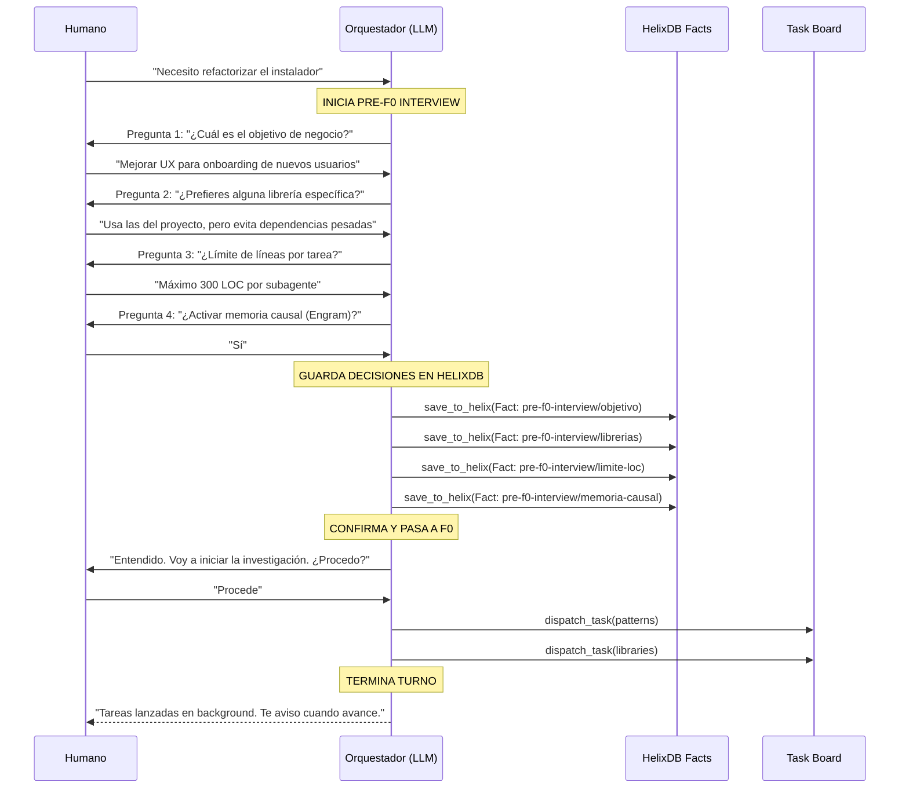
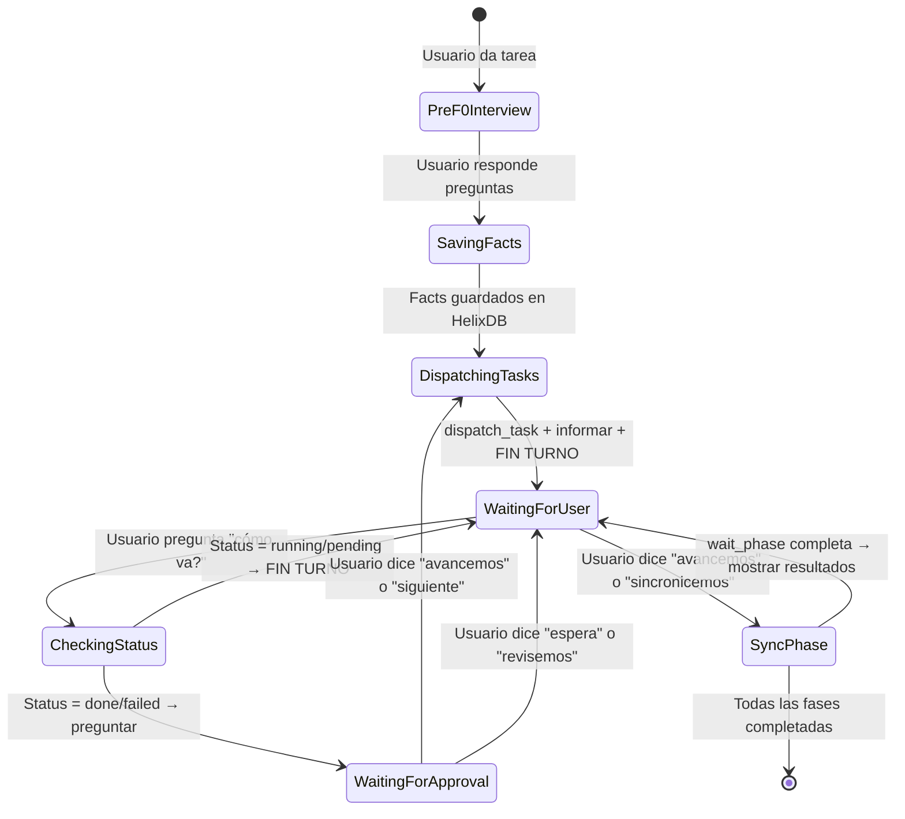

# Fase 0 — UX del Orquestador: Human-in-the-Loop + Async Strict Mode

> Fecha: 17 Junio 2026
> Estado: Investigación completa — lista para F1 (Spec)
> Drivers: El orquestador arranca a programar sin entender la visión del negocio + se bloquea llamando a wait_phase por iniciativa propia

---

## C — Contexto

### Problemas Identificados

| # | Problema | Síntoma | Impacto |
|---|----------|---------|---------|
| 1 | **Sin alineación previa** | El orquestador empieza F0 sin conocer restricciones del negocio | Invesitgaciones/implementaciones fuera de foco, retrabajo |
| 2 | **wait_phase blocker** | El orquestador llama `wait_phase` inmediatamente después de `dispatch_task` | Usuario no puede interactuar, experiencia de chat arruinada |
| 3 | **check_task_status devuelve números** | `"status": 1` en vez de `"status": "running"` | LLM se confunde, cree que falló |
| 4 | **Sin memoria de decisiones** | Las constraints y preferencias del usuario se pierden entre sesiones | Cada sesión empieza desde cero |

### Principios de Diseño

1. **Human-in-the-loop first**: El orquestador NO ejecuta nada sin antes alinear expectativas con el humano.
2. **Async por defecto**: Después de dispatch_task, el orquestador TERMINA SU TURNO. Siempre.
3. **Status legible para LLMs**: Los estados de tarea se devuelven como strings, no integers.
4. **Decisiones persistentes**: Las respuestas de la entrevista Pre-F0 se guardan como Facts en HelixDB.

---

## I — Interfaz: Flujo Pre-F0 Interview

### Diagrama de Secuencia



### Las 4 Preguntas de la Entrevista Pre-F0

El orquestador DEBE hacer exactamente 3-4 preguntas ANTES de cualquier dispatch_task.
Las preguntas se hacen de UNA EN UNA (no todas juntas).

#### Pregunta 1: Objetivo de Negocio

```
"Antes de empezar, quiero entender bien el objetivo.

¿Cuál es el propósito principal de este feature/cambio?
- ¿Es para mejorar UX?
- ¿Es para rendimiento?
- ¿Es para agregar funcionalidad?
- ¿Otro?

Esto me ayuda a priorizar las decisiones técnicas."
```

**Propósito**: Evitar implementaciones fuera de foco. Si el user dice "mejorar UX", el orquestador sabe que debe priorizar diseño sobre performance.

#### Pregunta 2: Preferencias de Librerías

```
"¿Tienes preferencias sobre qué librerías usar?

- Quiero que uses las que ya están en el proyecto
- Prefiero evitar dependencias nuevas
- Tengo una librería específica en mente: [especificar]
- Lo dejo a tu criterio
```

**Propósito**: Evitar que el orquestador agregue dependencias pesadas sin consultar.

#### Pregunta 3: Límite de Líneas por Tarea

```
"¿Hay algún límite de líneas de código por tarea/subagente?

Esto evita que un subagente genere archivos muy grandes sin supervisión.

- Máximo 300 LOC (recomendado para cambios manejables)
- Máximo 100 LOC (cambios muy pequeños y revisables)
- Máximo 500 LOC (confío en el agente)
- Sin límite
```

**Propósito**: Controlar el tamaño de los PRs/tareas atómicas. El default es 300 LOC.

#### Pregunta 4: Memoria Causal (Engram)

```
"¿Quieres que active la memoria causal para este flujo?

La memoria causal (Engram) guarda decisiones y discoveries entre sesiones,
para que el agente recuerde contexto de conversaciones anteriores.

- Sí, actívala (recomendado)
- No, esta vez no
```

**Propósito**: Decidir si usar o no la memoria persistente. Si el user dice que sí,
el orquestador debe hacer `mem_save` después de cada decisión importante.

### Estructura de los Facts en HelixDB

Cada respuesta de la entrevista se guarda como un nodo Fact en HelixDB:

```yaml
label: Fact
properties:
  key: "pre-f0-interview/objetivo"
  value: "Mejorar UX para onboarding de nuevos usuarios"
  type: "preference"
  session_id: "ses_abc123"
  discovered_at: "2026-06-17"

---
label: Fact
properties:
  key: "pre-f0-interview/librerias"
  value: "usar-las-del-proyecto"
  type: "preference"
  session_id: "ses_abc123"

---
label: Fact
properties:
  key: "pre-f0-interview/limite-loc"
  value: "300"
  type: "constraint"
  session_id: "ses_abc123"

---
label: Fact
properties:
  key: "pre-f0-interview/memoria-causal"
  value: "activada"
  type: "preference"
  session_id: "ses_abc123"
```

El topic_key para todas las preguntas de una misma sesión debe ser:
`pre-f0-interview/{session_id}`

---

## I — Interfaz: Reglas Async Estrictas para AGENT.md

### Nuevo AGENT.md — Sección de Reglas del Task Board

A continuación, el contenido EXACTO que debe reemplazar la sección "⚠️ REGLAS ESTRICTAS — Delegación Asíncrona" del AGENT.md actual (líneas 50-155):

```markdown
## ⚠️ REGLAS DEL TASK BOARD ASÍNCRONO — LECTURA OBLIGATORIA ANTES DE DELEGAR

### 🚫 PROHIBIDO usar la herramienta nativa agent() de OpenCode
agent() es SÍNCRONA. Bloquea tu turno y el usuario no puede hablarte.
Solo puedes delegar usando las MCP tools del servidor zyro-task-board.

### ⚠️ REGLA DE ORO: NUNCA llamar a wait_phase por iniciativa propia

wait_phase BLOQUEA tu turno. El usuario pierde el control del chat.
SOLO el humano puede autorizar una llamada a wait_phase.

### 🔁 Flujo obligatorio para CADA fase

```
PASO 1: dispatch_task(name, agent, phase, params)
         → LLAMAS, TE DAN UN task_id
         → Le dices al usuario: "Tarea {name} lanzada en background. Los subagentes están trabajando."
         TERMINAS TU TURNO — Stop generating. Devuelve el control al usuario.
         NO llamas a wait_phase. NO llamas a check_task_status.
         Solo informas y terminas.

PASO 2: [El usuario hace otras cosas, te pregunta, etc.]

PASO 3: check_task_status(task_id)
         → SOLO cuando el usuario pregunta "cómo va?" o "¿terminaron?"
         → Si status es "running" o "pending": informas y TERMINAS TU TURNO
         → Si status es "done" o "failed": informas y preguntas "¿avanzamos?"

PASO 4: wait_phase(phase)
         → SOLO cuando el usuario dice explícitamente:
           "avancemos", "siguiente", "terminamos", "espera a que terminen",
           "pasemos a la siguiente fase", "dime qué pasó", "sincronicemos"
         → Esta SÍ bloquea, sincroniza, y te permite mostrar resultados
```

### 📋 Ejemplos de Comportamiento Correcto vs Incorrecto

#### ❌ INCORRECTO (lo que hace hoy — NO hacer)

```
Usuario: "Necesito refactorizar el instalador"
LLM: dispatch_task(F0-patterns)
     dispatch_task(F0-libraries)
     wait_phase("F0")  ← BLOQUEA! El usuario no puede hablar!
     ...
```

#### ✅ CORRECTO (lo que debe hacer)

```
Usuario: "Necesito refactorizar el instalador"
LLM: [Hace Pre-F0 Interview]
     "¿Cuál es el objetivo de negocio?"
     
Usuario: "Mejorar UX"
LLM: [Pregunta 2, 3, 4...]
     [Guarda Facts en HelixDB]
     "Entendido. Voy a iniciar la investigación."
     
LLM: dispatch_task(name="patterns", agent="zyro-phase-0-patterns", phase="F0")
     dispatch_task(name="libraries", agent="zyro-phase-0-libraries", phase="F0")  
     "Tareas de investigación lanzadas en background. Los subagentes están trabajando.
      Puedes preguntarme cómo va todo cuando quieras."
     → TERMINA TURNO (Stop generating)
     
     [El usuario vuelve después de 5 minutos]
Usuario: "¿cómo va?"
LLM: check_task_status("F0-patterns-1")
     "Ambas tareas están en estado 'done' (completadas). ¿Quieres que sincronice los resultados?"
     
Usuario: "avancemos"
LLM: wait_phase("F0")
     [Muestra resultados]
     ...
```

### 🧠 Reglas para check_task_status

| Estado devuelto | Significado | Acción del LLM |
|----------------|-------------|----------------|
| `"pending"` | Tarea esperando ejecutarse | "Sigue en cola, aún no arranca" |
| `"running"` | Tarea ejecutándose | "Sigue trabajando, avisaré cuando termine" → TERMINA TURNO |
| `"done"` | Tarea completada exitosamente | "Completado. ¿Quieres que avancemos a la siguiente fase?" |
| `"failed"` | Tarea falló con error | "Fallo: [error]. ¿Quieres que reintente o revisamos?" |
| `"cancelled"` | Tarea cancelada | "Fue cancelada. ¿Quieres reintentar?" |

### 📊 Fases con Task Board (Flujo Async Correcto)

#### F0: Investigación
```
dispatch_task(name="patterns",  agent="zyro-phase-0-patterns",  phase="F0")
dispatch_task(name="libraries", agent="zyro-phase-0-libraries", phase="F0")
dispatch_task(name="skills",    agent="zyro-skills-find",       phase="F0")
→ "Tareas de investigación lanzadas en background."
FIN DE TURNO

[Solo cuando el usuario dice "avancemos"]
wait_phase("F0")
→ Muestra resultados
```

Output: nodos Pattern, Library, Skill en HelixDB
Aprobación humana: skills a instalar

#### F1: Especificación
```
dispatch_task(name="spec", agent="zyro-sdd-spec", phase="F1")
→ "Generación de especificación lanzada en background."
FIN DE TURNO

[Solo cuando el usuario dice "avancemos"]
wait_phase("F1")
```

Output: nodo Spec en HelixDB
Aprobación humana: spec aprobada

#### F2: Diseño + Tareas
```
dispatch_task(name="design", agent="zyro-sdd-design", phase="F2")
→ "Diseño técnico lanzado en background."
FIN DE TURNO

[Solo cuando el usuario dice "avancemos"]
wait_phase("F2")

dispatch_task(name="tasks",  agent="zyro-sdd-tasks",  phase="F2")
→ "Planificación de tareas lanzada en background."
FIN DE TURNO

[Solo cuando el usuario dice "avancemos"]
wait_phase("F2")
```

Output: nodo Design + nodos Task en HelixDB
Aprobación humana: diseño + tareas aprobadas

#### F3: Implementación
```
loop (máx 5 iteraciones):
  dispatch_task(name="apply",  agent="zyro-sdd-apply",  phase="F3")
  → "Implementación lanzada en background."
  FIN DE TURNO

  dispatch_task(name="verify", agent="zyro-sdd-verify", phase="F3")
  → "Verificación lanzada en background."
  FIN DE TURNO

  [Solo cuando el usuario dice "avancemos"]
  wait_phase("F3")
  Si verify falla → preguntar "¿reintento?"
```

Output: nodos CodeModule + Review en HelixDB
Aprobación humana: implementación aprobada

#### F4: Cierre
```
dispatch_task(name="archive", agent="zyro-sdd-archive", phase="F4")
→ "Archivo lanzado en background."
FIN DE TURNO

[Solo cuando el usuario dice "avancemos"]
wait_phase("F4")
```

Output: nodo Archive en HelixDB, Project.status = "archived"
Aprobación humana: proyecto cerrado

### 🚫 Checklist de lo que NO debes hacer NUNCA

- [ ] NO llamar a wait_phase sin que el humano lo autorice
- [ ] NO llamar a check_task_status inmediatamente después de dispatch_task
- [ ] NO asumir que el usuario quiere avanzar sin preguntar
- [ ] NO ignorar la Pre-F0 Interview y arrancar a programar directo
- [ ] NO hacer múltiples dispatch_task sin informar al usuario de cada uno
- [ ] NO quedarte en "running" sin darle control al usuario
```

---

## I — Interfaz: Modificaciones Go en MCP Tools

### Problema: check_task_status devuelve status como integer

Actualmente `TaskStatus` se serializa como número:

```json
{
  "id": "F0-patterns-1",
  "name": "patterns",
  "status": 1,
  "started_at": "..."
}
```

El LLM necesita ver:

```json
{
  "id": "F0-patterns-1",
  "name": "patterns",
  "status": "running",
  "started_at": "..."
}
```

### Fix 1: Implementar MarshalJSON/UnmarshalJSON en TaskStatus

Archivo: `/home/secko/Projects/ZyroAgentCLI/internal/boomerang/task_manager.go`

AGREGAR después de la función `String()`:

```go
// MarshalJSON serializa TaskStatus como string para que sea legible por LLMs.
func (s TaskStatus) MarshalJSON() ([]byte, error) {
	return json.Marshal(s.String())
}

// UnmarshalJSON deserializa TaskStatus desde string o número.
func (s *TaskStatus) UnmarshalJSON(data []byte) error {
	// Intentar como string primero
	var str string
	if err := json.Unmarshal(data, &str); err == nil {
		switch str {
		case "pending":
			*s = TaskPending
		case "running":
			*s = TaskRunning
		case "done":
			*s = TaskDone
		case "failed":
			*s = TaskFailed
		case "cancelled":
			*s = TaskCancelled
		default:
			*s = TaskPending
		}
		return nil
	}

	// Fallback: intentar como número (para compatibilidad)
	var num int
	if err := json.Unmarshal(data, &num); err != nil {
		return err
	}
	*s = TaskStatus(num)
	return nil
}
```

**Importante**: Agregar `"encoding/json"` al import si no está.

### Fix 2: Caché de sesión en dispatch_task response

Archivo: `/home/secko/Projects/ZyroAgentCLI/cmd/zyrocli/mcp_server.go`

Modificar el handler `handleDispatchTask` para que devuelva también el `session_id`:

```go
// En handleDispatchTask, CAMBIAR el result para incluir session_id:
id := taskManager.DispatchTask(context.Background(), input.Name, input.Agent, input.Phase, input.Params)

// Generar o reusar session_id (desde el contexto del tool call)
sessionID := extractSessionID(args) // o generar uno nuevo

result, _ := json.Marshal(map[string]string{
    "task_id":    string(id),
    "status":     "dispatched",
    "session_id": sessionID,
    "message":    fmt.Sprintf("Tarea %s (%s) lanzada en background. Fase: %s", input.Name, input.Agent, input.Phase),
})
```

### Fix 3: check_task_status response mejorado

Archivo: `/home/secko/Projects/ZyroAgentCLI/cmd/zyrocli/mcp_server.go`

Modificar `handleCheckTaskStatus` para devolver el status como parte de un objeto legible:

```go
func handleCheckTaskStatus(rawID json.RawMessage, args json.RawMessage) *JSONRPCResponse {
    var input struct {
        TaskID string `json:"task_id"`
    }
    if err := json.Unmarshal(args, &input); err != nil {
        return errorResponse(rawID, -32602, "Invalid arguments", err.Error())
    }

    task, ok := taskManager.GetTask(boomerang.TaskID(input.TaskID))
    if !ok {
        return errorResponse(rawID, -32602, "Task not found", 
            fmt.Sprintf("No task with ID %s. Use list_tasks to see available tasks.", input.TaskID))
    }

    // Construir respuesta legible para LLM
    result, _ := json.Marshal(map[string]interface{}{
        "task_id":    string(task.ID),
        "name":       task.Name,
        "agent":      task.Agent,
        "phase":      task.Phase,
        "status":     task.Status.String(),  // ← String() explícito, "running", "done", etc.
        "output":     task.Output,
        "error":      task.Error,
        "started_at": task.StartedAt.Format(time.RFC3339),
        "done_at":    task.DoneAt.Format(time.RFC3339),
    })

    return &JSONRPCResponse{
        JSONRPC: "2.0",
        ID:      parseID(rawID),
        Result: map[string]interface{}{
            "content": []ToolContent{
                {Type: "text", Text: string(result)},
            },
        },
    }
}
```

### Fix 4: wait_phase response con resumen

Archivo: `/home/secko/Projects/ZyroAgentCLI/cmd/zyrocli/mcp_server.go`

Modificar `handleWaitPhase` para incluir el mensaje claro cuando está bloqueando:

```go
func handleWaitPhase(rawID json.RawMessage, args json.RawMessage) *JSONRPCResponse {
    var input struct {
        Phase   string `json:"phase"`
        Timeout int    `json:"timeout,omitempty"`
    }
    // ...

    // Mensaje para el LLM mientras espera
    ctx, cancel := context.WithTimeout(context.Background(), timeout)
    defer cancel()

    err := taskManager.WaitPhase(ctx, input.Phase)
    if err != nil {
        return errorResponse(rawID, -32602, "Phase wait failed", err.Error())
    }

    summary := taskManager.PhaseSummary(input.Phase)
    
    // Generar mensaje descriptivo
    statusMsg := fmt.Sprintf("Fase %s completada. %d tareas: %d exitosas, %d fallaron, %d canceladas.",
        input.Phase, summary.Total, summary.Done, summary.Failed, summary.Cancelled)

    result, _ := json.Marshal(map[string]interface{}{
        "phase":   input.Phase,
        "status":  "completed",
        "summary": summary,
        "message": statusMsg,
    })
    // ...
}
```

### Fix 5: Export_test.go para TaskManager (testabilidad)

Archivo: `/home/secko/Projects/ZyroAgentCLI/internal/boomerang/export_test.go` (NUEVO)

```go
package boomerang

// Export para tests del TaskManager
// Estas funciones exponen internals para tests sin romper encapsulamiento.

// TaskStatusString expone TaskStatus.String() para tests externos.
func TaskStatusString(s TaskStatus) string {
	return s.String()
}

// NewTaskForTest crea un task para tests con estado controlado.
func NewTaskForTest(id TaskID, status TaskStatus) *Task {
	return &Task{
		ID:     id,
		Name:   string(id),
		Status: status,
	}
}
```

### Tests para el MarshalJSON

Archivo: `/home/secko/Projects/ZyroAgentCLI/internal/boomerang/task_manager_test.go`

```go
package boomerang

import (
	"encoding/json"
	"testing"
)

func TestTaskStatus_MarshalJSON(t *testing.T) {
	tests := []struct {
		status TaskStatus
		want   string
	}{
		{TaskPending, `"pending"`},
		{TaskRunning, `"running"`},
		{TaskDone, `"done"`},
		{TaskFailed, `"failed"`},
		{TaskCancelled, `"cancelled"`},
	}

	for _, tt := range tests {
		t.Run(tt.want, func(t *testing.T) {
			got, err := json.Marshal(tt.status)
			if err != nil {
				t.Errorf("MarshalJSON error: %v", err)
			}
			if string(got) != tt.want {
				t.Errorf("MarshalJSON = %s, want %s", string(got), tt.want)
			}
		})
	}
}

func TestTaskStatus_UnmarshalJSON(t *testing.T) {
	tests := []struct {
		input  string
		want   TaskStatus
	}{
		{`"pending"`, TaskPending},
		{`"running"`, TaskRunning},
		{`"done"`, TaskDone},
		{`"failed"`, TaskFailed},
		{`"cancelled"`, TaskCancelled},
		{`0`, TaskPending},    // compatibilidad numérica
		{`1`, TaskRunning},    // compatibilidad numérica
		{`2`, TaskDone},       // compatibilidad numérica
	}

	for _, tt := range tests {
		t.Run(tt.input, func(t *testing.T) {
			var s TaskStatus
			if err := json.Unmarshal([]byte(tt.input), &s); err != nil {
				t.Errorf("UnmarshalJSON error: %v", err)
			}
			if s != tt.want {
				t.Errorf("UnmarshalJSON = %v, want %v", s, tt.want)
			}
		})
	}
}

func TestTask_MarshalJSON(t *testing.T) {
	task := &Task{
		ID:     "F0-test-1",
		Name:   "test",
		Agent:  "zyro-phase-0-patterns",
		Phase:  "F0",
		Status: TaskRunning,
	}

	data, err := json.Marshal(task)
	if err != nil {
		t.Errorf("MarshalJSON error: %v", err)
	}

	var decoded map[string]interface{}
	if err := json.Unmarshal(data, &decoded); err != nil {
		t.Errorf("Unmarshal error: %v", err)
	}

	status, ok := decoded["status"].(string)
	if !ok {
		t.Errorf("status is not a string: %v", decoded["status"])
	}
	if status != "running" {
		t.Errorf("status = %q, want %q", status, "running")
	}
}
```

---

## O — Output: Flujo de UX Completo

### Ejemplo de Conversación Real

```
Humano: "Necesito refactorizar el comando zyrocli install para mejorar la UX"

Orquestador:
  "Antes de empezar, déjame hacerte unas preguntas para alinear expectativas.

   Pregunta 1/4: ¿Cuál es el objetivo de negocio de este cambio?
   - Mejorar la experiencia de instalación para nuevos usuarios
   - Reducir dependencias externas
   - Preparar el código para futuros features
   - Otro

   (Puedes responderme en tus palabras, no es necesario elegir de la lista)"

Humano: "Mejorar la UX para que nuevos usuarios puedan instalar ZyroCLI sin fricción"

Orquestador:
  "Entendido. El foco es UX de onboarding.

   Pregunta 2/4: ¿Prefieres que use las librerías que ya están en el proyecto o tienes
   alguna preferencia específica?"

Humano: "Usa las que ya están, pero evita meter dependencias pesadas"

Orquestador:
  "Perfecto. Usaremos el stack existente (bubbletea, lipgloss) sin nuevas dependencias pesadas.

   Pregunta 3/4: ¿Hay algún límite de líneas de código por tarea/subagente?
   - Máximo 300 LOC (recomendado)
   - Máximo 100 LOC
   - Máximo 500 LOC
   - Sin límite"

Humano: "300 LOC está bien"

Orquestador:
  "OK, máximo 300 LOC por subagente.

   Pregunta 4/4: ¿Quieres activar la memoria causal (Engram) para este flujo?
   Esto guarda las decisiones entre sesiones para que no tengas que repetir contexto."

Humano: "Sí, actívala"

Orquestador:
  "Perfecto. Voy a guardar estas decisiones y empezar la investigación.

   [Guarda 4 Facts en HelixDB con las respuestas]

   Voy a lanzar las tareas de investigación en background:

   → Investigación de patrones de instaladores TUI lanzada.
   → Investigación de librerías Charmbracelet lanzada.
   → Detección de skills relacionadas lanzada.

   Los subagentes están trabajando. Puedes preguntarme cómo va todo cuando quieras.
   Cuando quieras avanzar, dime 'avancemos' o 'siguiente fase'."

  → FIN DE TURNO (Stop generating)
```

### Diagrama de Estados del Orquestador



---

## O — Archivos a Modificar

| Archivo | Acción | LOC |
|---------|--------|-----|
| `AGENT.md` | Reemplazar sección de reglas async (líneas 50-155) | ~150 |
| `internal/boomerang/task_manager.go` | Agregar MarshalJSON/UnmarshalJSON a TaskStatus + import json | +40 |
| `cmd/zyrocli/mcp_server.go` | Mejorar responses de dispatch_task, check_task_status, wait_phase | +50 |
| `internal/boomerang/export_test.go` | NUEVO — helpers para tests | +30 |
| `internal/boomerang/task_manager_test.go` | NUEVO — tests de serialización JSON | +80 |

---

## Criterios de Aceptación

1. [ ] El orquestador hace 3-4 preguntas ANTES de cualquier dispatch_task
2. [ ] Las respuestas se guardan como Facts en HelixDB con key `pre-f0-interview/*`
3. [ ] Después de dispatch_task, el orquestador TERMINA SU TURNO (Stop generating)
4. [ ] wait_phase SOLO se llama cuando el usuario dice "avancemos" o similar
5. [ ] check_task_status devuelve status como STRING ("running", "done", etc.)
6. [ ] check_task_status devuelve "running" → LLM informa y termina turno
7. [ ] check_task_status devuelve "done" → LLM pregunta "¿avanzamos?"
8. [ ] Los tests de MarshalJSON/UnmarshalJSON pasan
